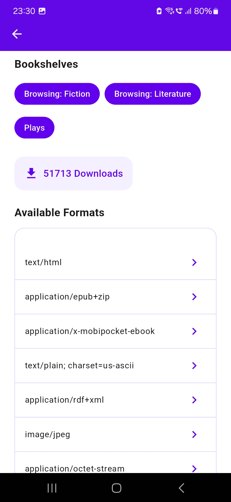
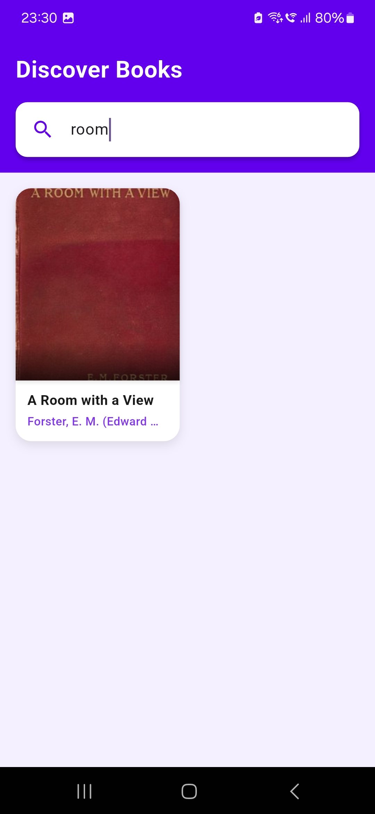
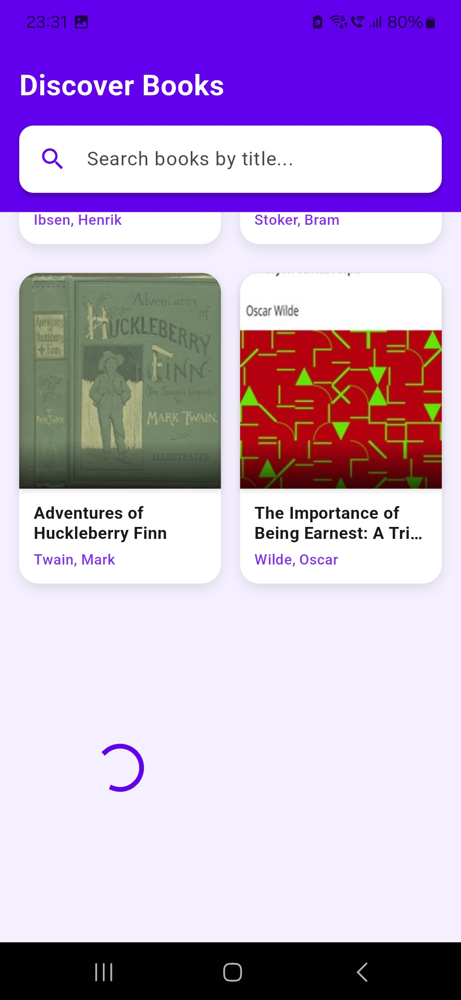

# 📚 Book Discovery App

A basic book discovery app developed using **Flutter**, which allows users to browse a list of books, view detailed information about each book, and search for specific titles. This app fetches book data from a public API (Gutendex API) and includes a clean, user-friendly interface and navigation between screens. The project follows the **Bloc (Business Logic Component) architecture** to manage state and ensure scalability.

---

## 🎯 **Features**

### ✅ **Book List Screen**
- Displays a list of books with their titles and cover images.
- Allows users to scroll through the list.
- Implements **pagination** to load more books when the user reaches the end of the list.

### ✅ **Book Detail Screen**
- When a user taps on a book item, it navigates to a detailed screen displaying more information about the selected book.

### ✅ **Search Feature **
- Users can search for books by title.

---

## 🛠️ **Technical Stack**
- **Framework:** Flutter
- **Language:** Dart
- **State Management:** Bloc Pattern
- **API:** [Gutendex API](https://gutendex.com/books/)

---

## 📁 **Project Structure**
The project is organized following the **feature-first structure** with a separation of concerns for data, domain, and presentation layers. The Bloc pattern is used for state management.

```
lib
├── data
│   ├── constants
│   │   └── env_config.dart           # Environment configuration
│   └── services
│       └── remote
│           └── api_service.dart     # Handles API calls to fetch book data
├── domain
│   ├── models
│   │   └── book.dart                # Book model
│   └── repositories
│       └── book_repository.dart    # Repository to manage data access
├── presentation
│   ├── books
│   │   ├── bloc
│   │   │   ├── books_bloc.dart      # Bloc to manage book list state
│   │   │   ├── books_event.dart     # Events for BooksBloc
│   │   │   └── books_state.dart     # States for BooksBloc
│   │   ├── components
│   │   │   └── book_list_item.dart  # UI component for individual book items
│   │   └── screens
│   │       ├── book_list_screen.dart # Displays the list of books
│   │       └── book_details_screen.dart # Displays detailed information about a book
│   └── navigation
│       └── bloc
│           ├── navigation_bloc.dart # Bloc to manage navigation
│           ├── navigation_event.dart # Events for NavigationBloc
│           └── navigation_state.dart # States for NavigationBloc
└── main.dart
```

---

## 🚀 **How to Run the Project**

### Prerequisites
- Flutter SDK installed on your machine
- A code editor (e.g., VS Code or Android Studio)

### Steps
1. Clone the repository:
   ```bash
   git clone [your-repository-link]
   ```
2. Navigate to the project directory:
   ```bash
   cd book_discovery_app
   ```
3. Get the dependencies:
   ```bash
   flutter pub get
   ```
4. Run the app:
   ```bash
   flutter run
   ```

---

## 🎨 **UI Design**
The app follows a clean and modern design with:
- A **scrollable book list**
- **Clickable book items** to navigate to the detail screen
- **Search bar** for quick access to specific books

## App Screenshots

<p align="center">
  
</p>

<p align="center">
  
</p>

<p align="center">
  
</p>

<p align="center">
  
</p>

<p align="center">
  
</p>

## 🔍 **State Management (Bloc Pattern)**
The **Bloc pattern** is used to manage state in the app. The `BooksBloc` handles fetching book data, responding to user events, and updating the UI state accordingly.


---


## 👩‍💻 **Developer Info**
**Tanisha Dixit**  
📧 Email: dixittanisha02@gmail.com  
🔗 GitHub: TanishaDixit0206

